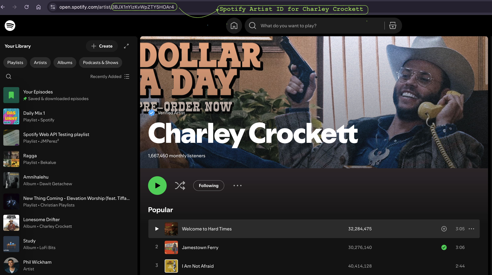
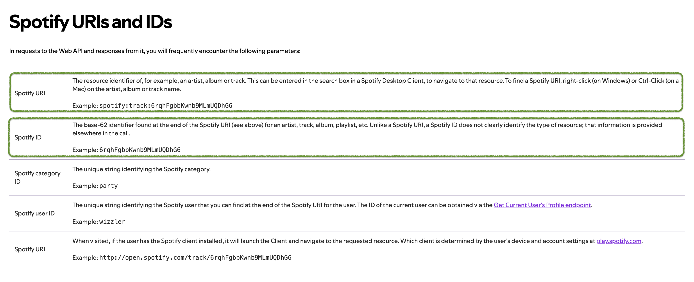
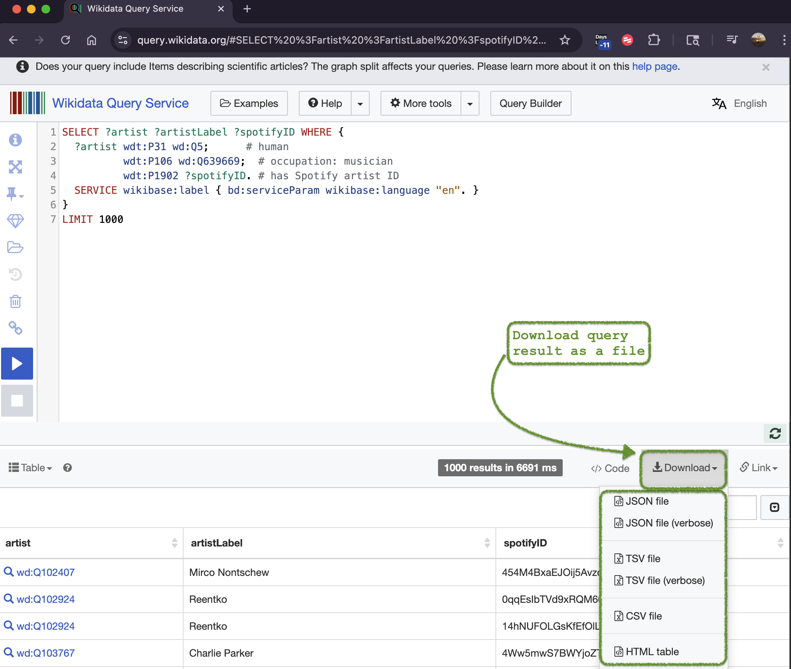

# 🎧 Spotify Metadata Collector

## 📌 Overview

This project focuses on retrieving and utilizing **Spotify metadata**—such as artists, albums, and tracks—for data enrichment, analytics, and integration with other datasets.

The core contribution is the automated retrieval of **8,000+ Spotify IDs**, opening doors for deeper analytics and insights on popularity, follower counts, and estimated monthly listeners using spotify data.

[](https://youtu.be/BMG9xX09JMg)

### Why the automation matters ?

Manually collecting Spotify IDs, such as searching using the artist's name on spotify, is time-consuming. This project streamlines the process using **SPARQL queries via Wikidata**, allowing you to:

- Programmatically gather thousands of Spotify IDs
- Use these IDs to pull enriched metadata via Spotify's Web API
- Enable large-scale music analytics and research

### 🔍 Collecting Spotify IDs

#### Why IDs Matter?

Spotify API requires unique IDs (embedded in URIs) to fetch metadata for artists, albums, or tracks.To understand how Spotify IDs are used, look at the screenshot below for example:




### Manual vs Automated ID Collection

- **Manual:** Search by artist name on Spotify
- **Automated:** Use SPARQL queries via [Wikidata Query Service](https://query.wikidata.org/)

Example SPARQL Query – Artists

```sparql
SELECT ?artist ?artistLabel ?spotifyID WHERE {
  ?artist wdt:P31 wd:Q5;        # instance of human
          wdt:P106 wd:Q639669;  # occupation: musician
          wdt:P1902 ?spotifyID. # has Spotify artist ID
  SERVICE wikibase:label { bd:serviceParam wikibase:language "en". }
}
LIMIT 1000
```

#### Sample Result:

Example SPARQL Query – Albums

```sparql
SELECT ?album ?albumLabel ?spotifyID ?artist ?artistLabel WHERE {
  ?album wdt:P31/wdt:P279* wd:Q482994;  # instance/subclass of album
         wdt:P2205 ?spotifyID;          # Spotify album ID
         wdt:P175 ?artist.              # performer
  SERVICE wikibase:label { bd:serviceParam wikibase:language "en". }
}
LIMIT 1000000
```

> 🎯 You can download the result as a CSV directly from the query interface.



## 🛠️ Setup Instructions

### 1. Create Pipenv virtual environment

First Install pipenv on your machine, follow the directions [here](https://pipenv.pypa.io/en/latest/installation.html).

Activate virtual environment:

```bash
pipenv shell
```

### 2. Install Dependencies

```bash
pipenv install
```

### 3. Get Spotify Developer Credentials

1. Visit the [Spotify Developer Dashboard](https://developer.spotify.com/dashboard)
2. Log in and click **"Create App"**
3. Fill out app details:
   - **App Name:** `Any name `
   - **Description:** `any desc`
   - **Redirect URI:** `http://localhost:8888/callback`
4. Save the app and copy the **Client ID** and **Client Secret**

### 3. Configure Environment Variables

Create a `.env` file in the project root with the following:

```bash
SPOTIFY_CLIENT_ID=your_client_id
SPOTIFY_CLIENT_SECRET=your_client_secret
```

> ✅ Ensure `.env` is listed in `.gitignore` to avoid committing sensitive information.

# Further information & References

- 📚 [Spotify Web API Documentation](https://developer.spotify.com/documentation/web-api)
- 🧪 [Try API Requests in Web Tool](https://developer.spotify.com/documentation/web-api/reference/get-an-album)

### 🔌 Spotify API Supported Endpoints

- **Artists**: Profile info, top tracks, related artists
- **Tracks**: Metadata, audio features, analysis
- **Albums**: Details and track listings
- **Playlists**: Info and tracks
- **Search**: Multi-type search
- **Audio Features**: Tempo, energy, key, etc.

### 🔒 Security Guidelines

- Keep your API credentials safe and private (Never commit your `.env` file to Git)
- Use `.gitignore` to exclude sensitive files

## Understanding the Metadata

| Field          | Description                                          |
| -------------- | ---------------------------------------------------- |
| **Popularity** | Spotify’s internal popularity score (0–100)          |
| **Followers**  | Number of users following the artist on Spotify      |
| **Genres**     | Spotify-inferred genres                              |
| **Streams**    | Rough estimate based on popularity and track metrics |

> ⚠️ Spotify does **not** publicly provide exact stream counts.

## Troubleshooting

| Issue                   | Solution                                        |
| ----------------------- | ----------------------------------------------- |
| Missing credentials     | Verify `.env` setup                             |
| Import errors           | Run `pipenv install`                            |
| Spotify API rate limits | Delays are built-in; avoid frequent requests    |
| Lookup failures         | Ensure `create_lookup_dataframes()` is executed |

## Notes

- API rate limits apply; excessive calls may be throttled
- Popularity and follower metrics are dynamic and updated frequently
- Streaming estimates are inferred, not exact
- All ID collection respects Spotify API limits and best practices
